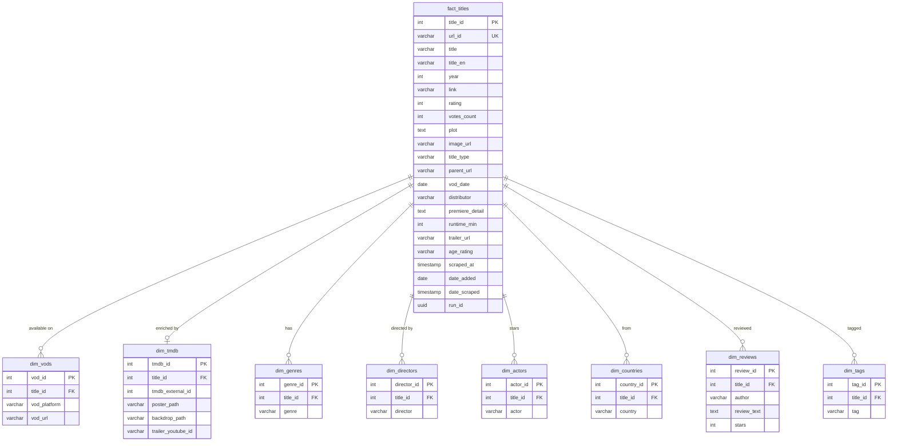

# feat: Streamfinder — VOD Discovery App

## Overview

Build **Streamfinder**, an interactive SvelteKit web app for browsing, searching, and exploring ~6000 VOD titles available on Czech streaming platforms. Data sourced from the existing CSFD.cz scraping pipeline (PostgreSQL). Deployed as a static site on GitHub Pages.

Dark cinema aesthetic (deep navy + warm amber), Czech language UI, TMDB high-res imagery, pill-based faceted search, past-dominant calendar, LayerCake/D3 charts.

**5 routes:** `/` (homepage), `/katalog` (faceted search), `/kalendar` (filmstrip timeline), `/insights` (charts), `/titul/{slug}` (title detail)

## Problem Statement / Motivation

The existing dashboard (`dashboard/index.html`) is a single-page Plotly visualization with aggregated stats. It cannot browse individual titles, search/filter, or show high-quality imagery. Streamfinder replaces it with a full discovery experience — portfolio-grade and shareable with friends/family.

## Proposed Solution

**8-phase implementation** spanning backend (schema + parser + enrichment + export) and frontend (SvelteKit app with 5 routes). Each phase is independently deployable and testable.

---

## Technical Approach

### Architecture

```
┌─────────────────────────────────────────────────────────────┐
│  Python Pipeline (existing + extensions)                     │
│                                                              │
│  harvest → scrape → parse → load → [tmdb_enrich] → export   │
│                                         ↓                    │
│                               PostgreSQL (star schema)        │
│                                         ↓                    │
│                              dashboard/data/*.json            │
└─────────────────────────────────┬───────────────────────────┘
                                  │
                    ┌─────────────▼──────────────┐
                    │  SvelteKit (static adapter)  │
                    │  streamfinder/               │
                    │    src/routes/               │
                    │      +page.svelte      (/)   │
                    │      katalog/               │
                    │      kalendar/              │
                    │      insights/              │
                    │      titul/[slug]/          │
                    │    src/lib/                 │
                    │      data/   (JSON loaders) │
                    │      components/            │
                    │      stores/                │
                    │    static/                  │
                    │      data/*.json            │
                    └──────────┬─────────────────┘
                               │ npm run build
                               ▼
                    GitHub Pages (static HTML/JS/CSS)
```

**Key design decision:** JSON data files are generated by the Python exporter and placed in `streamfinder/static/data/`. SvelteKit reads them at build time for SSG and they're also available as static assets for client-side filtering/navigation.

### Data flow

1. Python exporter queries PostgreSQL → writes JSON files to `streamfinder/static/data/`
2. SvelteKit `npm run build` reads JSON at build time → pre-renders all routes
3. Client-side: JSON loaded for interactive filtering (Katalog), chart rendering (Insights)
4. GitHub Actions: `csfd dashboard` → `npm run build` → deploy to `gh-pages` branch

---

## Implementation Phases

### Phase 1: Schema Changes + Migration

**Goal:** Add new columns and refactor dim_vods to support per-platform URLs.

**Files to modify:**

| File | Change |
|------|--------|
| `db/schema.sql` | Add columns to fact_titles, add vod_url to dim_vods |
| `db/migrations/003_streamfinder_fields.sql` | New migration file |

**Schema additions to `fact_titles`:**
```sql
ALTER TABLE csfd_vod.fact_titles ADD COLUMN IF NOT EXISTS runtime_min INTEGER;
ALTER TABLE csfd_vod.fact_titles ADD COLUMN IF NOT EXISTS votes_count INTEGER;
ALTER TABLE csfd_vod.fact_titles ADD COLUMN IF NOT EXISTS trailer_url VARCHAR(500);
ALTER TABLE csfd_vod.fact_titles ADD COLUMN IF NOT EXISTS age_rating VARCHAR(20);
```

**Schema additions to `dim_vods`:**
```sql
ALTER TABLE csfd_vod.dim_vods ADD COLUMN IF NOT EXISTS vod_url VARCHAR(500);
```

**TMDB enrichment table:**
```sql
CREATE TABLE IF NOT EXISTS csfd_vod.dim_tmdb (
    tmdb_id SERIAL PRIMARY KEY,
    title_id INTEGER NOT NULL UNIQUE REFERENCES csfd_vod.fact_titles(title_id) ON DELETE CASCADE,
    tmdb_external_id INTEGER,
    poster_path VARCHAR(500),
    backdrop_path VARCHAR(500),
    trailer_youtube_id VARCHAR(100)
);
CREATE INDEX IF NOT EXISTS idx_tmdb_title_id ON csfd_vod.dim_tmdb(title_id);
```

**Scope decision (from SpecFlow analysis):** Keep `vod_date` on `fact_titles` as "first seen on any VOD" date. CSFD does not reliably provide per-platform dates in a structured format. The brainstorm's dim_vods refactor for `vod_date` is **deferred** — only `vod_url` is added to dim_vods now. (see brainstorm: Schema Changes Required — simplified after data source validation)

**Acceptance criteria:**
- [ ] Migration runs cleanly on existing database
- [ ] All new columns are nullable (no data loss)
- [ ] `schema.sql` updated as source of truth
- [ ] `dim_tmdb` table created with FK to fact_titles

---

### Phase 2: Parser Updates — New Field Extraction

**Goal:** Extract runtime, votes, trailer, age rating, and VOD watch URLs from cached HTML.

**Files to modify:**

| File | Change |
|------|--------|
| `src/csfd_vod/transformation/parser.py` | Add 5 new field extractors |
| `src/csfd_vod/transformation/models.py` | Add new fields to VODTitle model |
| `src/csfd_vod/loading/postgres_loader.py` | Handle new columns in upsert |
| `tests/test_parser.py` | Tests for new extractors |

**New extractors in `parser.py`:**

1. **`votes_count`** — Extract from rating count element (e.g., `.film-rating-count` or adjacent to `.film-rating-average`). CSFD shows "123 456 hodnocení" — parse integer from text.

2. **`runtime_min`** — Extract from `.origin` info block. CSFD shows "120 min" or "1h 50 min" — parse to integer minutes.

3. **`trailer_url`** — Extract from `.box-trailer iframe[src]` or similar YouTube embed. Store full YouTube URL.

4. **`age_rating`** — Extract from `.film-info` area. CSFD shows "Přístupnost: od 15 let" or similar.

5. **`vod_url` (per-platform watch link)** — Modify existing VOD extraction at [parser.py:170-177](src/csfd_vod/transformation/parser.py#L170-L177):

```python
# Current: extracts only platform name
platforms = [a.get_text(strip=True) for a in vod_links ...]

# New: extract name + href pairs
vod_entries = []
for a in vod_links:
    name = a.get_text(strip=True)
    if name.lower() not in ("více", ""):
        vod_entries.append({"platform": name, "url": a.get("href", "")})
```

**Model changes in `models.py`:**
```python
runtime_min: Optional[int] = None
votes_count: Optional[int] = None
trailer_url: Optional[str] = None
age_rating: Optional[str] = None
vod_urls: Optional[dict[str, str]] = None  # {"Netflix": "https://...", ...}
```

**Loader changes:** Update `postgres_loader.py` upsert to:
- Insert new fact_titles columns
- Insert `vod_url` alongside `vod_platform` in dim_vods

**Acceptance criteria:**
- [ ] `votes_count` extracted for titles that have ratings (expected ~70% fill rate)
- [ ] `runtime_min` extracted for films (expected ~80% fill rate)
- [ ] `vod_url` captured from existing `.film-vod-list a[href]` elements
- [ ] New fields stored in PostgreSQL after re-parse
- [ ] Tests cover extraction from sample HTML fixtures
- [ ] Re-parse all cached HTML: `csfd parse`

---

### Phase 3: TMDB Enrichment Pipeline Step

**Goal:** Match titles to TMDB, fetch poster/backdrop/trailer metadata, store in dim_tmdb.

**New files:**

| File | Purpose |
|------|---------|
| `src/csfd_vod/enrichment/__init__.py` | Package |
| `src/csfd_vod/enrichment/tmdb_enricher.py` | TMDB API client + matching logic |
| `tests/test_tmdb_enricher.py` | Tests with mocked API responses |

**New CLI subcommand:**
```
csfd enrich [--limit N] [--force]
```

**Matching strategy:**
1. Search TMDB by `title_en` + `year` (English title more reliable for TMDB)
2. Fallback: search by `title` (Czech) + `year`
3. If multiple results: pick the one where `release_date` year matches
4. If 0 results after both attempts: mark as unmatched (keep CSFD `image_url`)
5. Store `tmdb_external_id`, `poster_path`, `backdrop_path`, `trailer_youtube_id`

**Rate limiting:** TMDB free tier = 40 req/sec. Use 30 req/sec with backoff. Initial enrichment of 6000 titles ≈ 3-4 minutes.

**Incremental:** Only enrich titles not yet in dim_tmdb (new additions each week).

**Environment:** `TMDB_API_KEY` in `.env`. Add to `.env.example`.

**Acceptance criteria:**
- [ ] TMDB API key configured and working
- [ ] Match rate ≥ 70% of titles with rating > 0
- [ ] Poster path + backdrop path stored for matched titles
- [ ] Unmatched titles gracefully fall back to CSFD image_url
- [ ] Incremental: re-running only processes new titles
- [ ] Rate limiting prevents API throttling

---

### Phase 4: Streamfinder JSON Exporter

**Goal:** New export mode that produces per-title JSON data for the SvelteKit app.

**Files to modify/create:**

| File | Change |
|------|--------|
| `src/csfd_vod/export/exporter.py` | Add `export_streamfinder()` method |
| `src/csfd_vod/main.py` | Add `--streamfinder` flag to dashboard command |

**JSON output structure** — split into two files for performance (see SpecFlow Q3):

**`titles_index.json`** (~1.5MB gzipped) — lightweight for Katalog grid + Kalendar + search:
```json
[
  {
    "id": 1234,
    "slug": "matrix-1999",
    "t": "Matrix",
    "te": "The Matrix",
    "y": 1999,
    "r": 87,
    "v": 45678,
    "tt": "film",
    "rt": 136,
    "vd": "2026-03-15",
    "img": "/tUABMr4Y71BgQgEEewShVgoX4Rg.jpg",
    "img_csfd": "https://image.pmgstatic.com/...",
    "g": [1, 5, 12],
    "p": [1, 3],
    "c": [8],
    "tg": [2, 7]
  }
]
```

**`dimensions.json`** — lookup tables for IDs used in titles_index:
```json
{
  "genres": {"1": "Drama", "5": "Akční", "12": "Sci-Fi"},
  "platforms": {"1": "Netflix", "3": "HBO Max"},
  "countries": {"8": "USA"},
  "tags": {"2": "kultovní", "7": "atmosférický"}
}
```

**`titles_detail.json`** — full data for title detail pages (loaded on demand or at build time):
```json
{
  "1234": {
    "slug": "matrix-1999",
    "title": "Matrix",
    "title_en": "The Matrix",
    "year": 1999,
    "rating": 87,
    "votes_count": 45678,
    "title_type": "film",
    "runtime_min": 136,
    "age_rating": "od 12 let",
    "plot": "Programátor Thomas Anderson...",
    "vod_date": "2026-03-15",
    "image_url": "https://image.pmgstatic.com/...",
    "poster_path": "/tUABMr4Y71BgQgEEewShVgoX4Rg.jpg",
    "backdrop_path": "/fNG7i7RqMErkcqhohV2a6cV1Ehy.jpg",
    "trailer_youtube_id": "m8e-FF8MsqU",
    "link": "https://www.csfd.cz/film/1234/",
    "genres": ["Akční", "Sci-Fi", "Drama"],
    "directors": ["Lana Wachowski", "Lilly Wachowski"],
    "actors": ["Keanu Reeves", "Laurence Fishburne"],
    "countries": ["USA"],
    "tags": ["kultovní", "atmosférický"],
    "screenwriters": ["Lana Wachowski"],
    "cinematographers": ["Bill Pope"],
    "composers": ["Don Davis"],
    "vod_platforms": [
      {"name": "Netflix", "url": "https://www.netflix.com/title/..."}
    ],
    "reviews": [
      {"author": "user1", "stars": 5, "text": "Dokonalý film..."},
      {"author": "user2", "stars": 4, "text": "Vizuálně..."},
      {"author": "user3", "stars": 3, "text": "Přeceňovaný..."}
    ]
  }
}
```

**`summary.json`** — keep existing format + add `export_timestamp`, `last_vod_date`.

**Slug generation:** Czech-safe slugify: `title + "-" + year`, lowercased, diacritics stripped, spaces → hyphens. E.g., "Účastníci zájezdu" (2006) → `ucastnici-zajezdu-2006`. Handle collisions by appending `-2`, `-3`.

**Acceptance criteria:**
- [ ] `csfd dashboard --streamfinder` writes JSON files to `streamfinder/static/data/`
- [ ] `titles_index.json` ≤ 4MB uncompressed (target: ~2MB)
- [ ] All 6000+ titles exported with joined dimensions
- [ ] Slugs are unique and URL-safe
- [ ] TMDB image paths included (NULL for unmatched titles)
- [ ] Reviews limited to top 3 per title in detail JSON

---

### Phase 5: SvelteKit Scaffold + Homepage

**Goal:** Initialize SvelteKit project and build the homepage with hero, recent additions, and genre tiles.

**New directory:**
```
streamfinder/
├── svelte.config.js       # static adapter, prerender
├── package.json
├── vite.config.js
├── src/
│   ├── app.html
│   ├── app.css             # CSS variables, global styles, grain texture
│   ├── routes/
│   │   ├── +layout.svelte  # Nav bar, footer
│   │   ├── +layout.js      # Load shared data (dimensions, summary)
│   │   └── +page.svelte    # Homepage
│   └── lib/
│       ├── components/
│       │   ├── Nav.svelte
│       │   ├── PosterCard.svelte
│       │   ├── PosterRow.svelte
│       │   ├── VodBadge.svelte
│       │   ├── RatingBadge.svelte
│       │   └── GenreTile.svelte
│       ├── stores/
│       │   └── data.js      # Svelte stores for loaded JSON
│       └── utils/
│           ├── tmdb.js      # TMDB image URL helpers (size variants)
│           └── slug.js      # Slug utilities
├── static/
│   ├── data/               # JSON files from Python exporter
│   └── fonts/              # Self-hosted typography
```

**Homepage sections (see brainstorm: Homepage):**

1. **Hero (split layout):**
   - Left: featured title — highest-rated from past 21 days, rating ≥ 75, votes ≥ 500, TMDB backdrop available. Fallback: extend to 45 days, then hardcoded override.
   - Right: "Nedávno přibylo" — compact date-grouped list (past 7-14 days). Below: "Brzy přibude" **deferred to v2** (no reliable future date data source — see SpecFlow Q2).

2. **Scroll sections:**
   - "Nové na VOD tento týden" — horizontal poster row
   - "Nejlépe hodnocené tento měsíc" — horizontal poster row
   - "Procházej podle žánru" — genre tiles (click → `/katalog?genre=X`)
   - Quick stat teaser → CTA to `/insights`

**Design system:**
- CSS variables for color palette (deep navy `#0d1117`, amber `#e8a043`, off-white `#f0f2f5`)
- Typography: serif display (Playfair Display or similar) + sans body (Inter)
- Film grain SVG texture overlay (subtle, CSS `mix-blend-mode`)
- Slow easing transitions (`cubic-bezier(0.4, 0, 0.2, 1)`)

**Acceptance criteria:**
- [ ] `npm run dev` serves homepage locally
- [ ] Hero selects featured title correctly from JSON data
- [ ] Poster rows horizontally scrollable with snap points
- [ ] Genre tiles link to `/katalog?genre=X`
- [ ] Responsive: mobile collapses hero to stacked layout
- [ ] TMDB images load with lazy loading + fallback to CSFD image
- [ ] Nav bar with 4 links + search icon (search implemented in Phase 6)
- [ ] Footer with "Poslední aktualizace: {date}" from summary.json

---

### Phase 6: Katalog — Faceted Search + Poster Grid

**Goal:** Full browsable catalog with pill-based filters, poster grid, and modal detail overlay.

**New files:**

| File | Purpose |
|------|---------|
| `streamfinder/src/routes/katalog/+page.svelte` | Katalog page |
| `streamfinder/src/routes/katalog/+page.js` | Data loader |
| `streamfinder/src/lib/components/FacetPanel.svelte` | Filter sidebar |
| `streamfinder/src/lib/components/FilterPill.svelte` | Individual pill |
| `streamfinder/src/lib/components/ActiveFilters.svelte` | Removable chips |
| `streamfinder/src/lib/components/PosterGrid.svelte` | Responsive grid |
| `streamfinder/src/lib/components/TitleModal.svelte` | Detail overlay |
| `streamfinder/src/lib/components/SearchOverlay.svelte` | Global search |
| `streamfinder/src/lib/stores/filters.js` | Filter state + URL sync |

**Facet panel (see brainstorm: Katalog):**

| Facet | Type | Source |
|---|---|---|
| Žánry | color-coded pills | dimensions.json → genres |
| Tagy | pills | dimensions.json → tags |
| VOD služby | branded pills | dimensions.json → platforms |
| Země | pills (top 20 + "Další...") | dimensions.json → countries |
| Typ | pills | film / seriál / pořad / tv film |
| Rok vydání | bucket pills | 2020s, 2010s, 2000s, 90s, starší |
| Hodnocení | bucket pills | Výborné 85+, Velmi dobré 75-85, Dobré 60-75, Průměr <60 |
| Režisér | autocomplete text → pill | Fuse.js client-side search over directors list |
| Herci | autocomplete text → pill | Fuse.js client-side search over actors list |

**Client-side filtering:** All filtering runs in JavaScript over `titles_index.json` using Set intersection for pill filters. Fuse.js for autocomplete (directors, actors). ~6000 items — fast enough for modern browsers.

**Filter state in URL:** Encode as query params: `/katalog?genre=Drama,Akční&vod=Netflix&rating=85`. Enables sharing filtered views and back-button behavior. Svelte store syncs bidirectionally with `$page.url.searchParams`.

**Progressive filtering:** After each filter change, recompute which remaining pill values yield >0 results. Disable/dim pills that would give 0. (SpecFlow finding: must handle this efficiently — pre-compute per filter, not full cross-product.)

**Default state (SpecFlow Q4):** All titles shown, sorted by `vod_date` desc. Pagination: 48 titles per page (4×12 or 6×8 grid depending on viewport). "Načíst další" button for next page.

**Sort options:** Dropdown above grid — Nejnovější na VOD / Nejlépe hodnocené / Rok (nejnovější) / Abecedně.

**Modal detail overlay:** Click poster → slide-in modal with title detail (same content as `/titul/{slug}`). Preserves scroll position and filter state. "Otevřít stránku titulu" button navigates to full page. Escape / click outside to close.

**Global search (nav icon):** Opens overlay with text input. Fuse.js fuzzy search over title + title_en. Shows top 8 results as compact list. Click → navigate to `/titul/{slug}`.

**Mobile (SpecFlow Q10):** Facet panel becomes a bottom sheet triggered by floating "Filtrovat" button. Active filter count shown on button badge.

**Acceptance criteria:**
- [ ] All facets work and combine correctly (AND between facet types, OR within)
- [ ] Progressive filtering disables empty pills
- [ ] URL reflects filter state — shareable links work
- [ ] Autocomplete for directors/actors returns relevant results
- [ ] Poster grid paginated at 48, loads more on click
- [ ] Modal overlay shows full title detail
- [ ] Global search finds titles by Czech and English name
- [ ] Mobile: bottom sheet filters, responsive grid (2 columns)
- [ ] 0-results state: "Žádné tituly neodpovídají filtrům" message

---

### Phase 7: Kalendář — Past-Dominant Filmstrip Timeline

**Goal:** Horizontal timeline of VOD arrivals anchored at today.

**New files:**

| File | Purpose |
|------|---------|
| `streamfinder/src/routes/kalendar/+page.svelte` | Calendar page |
| `streamfinder/src/lib/components/FilmstripDay.svelte` | Day column |
| `streamfinder/src/lib/components/FilmstripTimeline.svelte` | Scrollable container |

**Layout (see brainstorm: Kalendář):**

1. **Past zone (above DNES):** 3-4 weeks of history. Each day = one column. Primary title (highest rated that day) gets large poster + metadata. Secondary titles as smaller tiles below. Horizontal scroll with CSS `scroll-snap-type: x mandatory`. Lazy-load older weeks on scroll.

2. **DNES anchor:** Amber horizontal line with date label. Auto-scrolled to on page load.

3. **Future zone (below DNES):** Compact row — **deferred to v2** (same reason as Homepage "Brzy přibude": no future date data source).

**Date handling (SpecFlow Q7):** Each title appears on its `vod_date` from fact_titles (the earliest known VOD date). Multiple platforms shown as badges. Empty days: show thin column with date label, no poster (preserves timeline continuity).

**Quick time links:** Dnes / Tento týden / Minulý týden / Tento měsíc — scroll to position + update URL hash.

**Filters:** VOD service pills, title type pills, genre pills (simplified subset of Katalog filters).

**Acceptance criteria:**
- [ ] Timeline renders past 4 weeks with correct date columns
- [ ] DNES anchor is visually prominent and auto-focused on load
- [ ] Empty days show as narrow columns (not hidden)
- [ ] Horizontal scroll smooth with snap points
- [ ] Quick time links scroll to correct position
- [ ] Filters narrow displayed titles
- [ ] Click poster → opens TitleModal overlay
- [ ] Mobile: horizontal swipe works naturally

---

### Phase 8: Insights + Title Detail Page + Deployment

**Goal:** Charts page, standalone title detail route, and GitHub Pages deployment.

#### 8a: Insights (`/insights`)

**New files:**

| File | Purpose |
|------|---------|
| `streamfinder/src/routes/insights/+page.svelte` | Insights page |
| `streamfinder/src/lib/components/charts/BarChart.svelte` | LayerCake bar |
| `streamfinder/src/lib/components/charts/ScatterPlot.svelte` | LayerCake scatter |
| `streamfinder/src/lib/components/charts/QuadrantChart.svelte` | Hidden gems |
| `streamfinder/src/lib/components/charts/CountUp.svelte` | Animated number |

**v1 charts (see brainstorm: Insights — must-have):**
- Headline numbers with count-up animation (total titles, services, genres, % films, avg rating)
- Bar chart: title count per VOD service (horizontal, sorted)
- Scatter plot with switchable dimensions: avg rating × title count by VOD/country/genre/director. Bubble size = total votes.
- "Hidden gems" quadrant: votes × rating, 4 labeled quadrants. Clickable dots → `/titul/{slug}`.

**v2 charts (deferred):** Rating violin, timeline stacked area, genre treemap, genre×VOD heatmap, world map.

#### 8b: Title Detail (`/titul/[slug]`)

**New files:**

| File | Purpose |
|------|---------|
| `streamfinder/src/routes/titul/[slug]/+page.svelte` | Full detail page |
| `streamfinder/src/routes/titul/[slug]/+page.js` | Data loader + prerender entries |

**Layout (see brainstorm: Title Detail):** TMDB backdrop → poster + metadata + genre pills + VOD platform links → plot → trailer embed → crew → actors → tags → top 3 reviews → back button + CSFD link.

**Prerendering:** SvelteKit `entries()` function returns all slugs from `titles_index.json`. Generates ~6000 HTML files at build time. Each page is self-contained with meta tags for SEO/sharing.

**URL slug (SpecFlow Q5):** Use slugified `title-year` format. E.g., `/titul/matrix-1999`. Generated during JSON export (Phase 4). Slug stored in both index and detail JSON.

**Image fallback chain:** TMDB backdrop → TMDB poster (blurred) → CSFD image → placeholder gradient. `` handler cascades through fallbacks.

#### 8c: SEO + Meta Tags

**Per-page meta (SpecFlow Q17):**
```svelte
<svelte:head>
  <title>{title.title} ({title.year}) — Streamfinder</title>
  <meta name="description" content="{title.plot?.slice(0, 160)}" />
  <meta property="og:image" content="https://image.tmdb.org/t/p/w780{title.poster_path}" />
</svelte:head>
```

Generate `sitemap.xml` at build time from all title slugs.

#### 8d: GitHub Pages Deployment

**GitHub Actions workflow:**
```yaml
name: Deploy Streamfinder
on:
  workflow_dispatch:
  # Could also trigger after pipeline run

jobs:
  deploy:
    runs-on: ubuntu-latest
    steps:
      - uses: actions/checkout@v4
      - uses: actions/setup-node@v4
        with: { node-version: 20 }
      - run: cd streamfinder && npm ci && npm run build
      - uses: peaceiris/actions-gh-pages@v3
        with:
          github_token: ${{ secrets.GITHUB_TOKEN }}
          publish_dir: streamfinder/build
```

**SvelteKit config:**
```js
// svelte.config.js
import adapter from '@sveltejs/adapter-static';
export default {
  kit: {
    adapter: adapter({ fallback: '404.html' }),
    paths: { base: '' }
  }
};
```

**Acceptance criteria (Phase 8 combined):**
- [ ] All 4 v1 charts render with real data
- [ ] Count-up animations respect `prefers-reduced-motion`
- [ ] Scatter plot dimension switching works
- [ ] Hidden gems quadrant dots clickable → title detail
- [ ] `/titul/{slug}` renders full detail with all fields
- [ ] TMDB backdrop loads with fallback chain
- [ ] Trailer YouTube embed works (lazy-loaded)
- [ ] Top 3 reviews displayed (no "show more")
- [ ] VOD platform links clickable (open in new tab)
- [ ] All ~6000 title pages pre-rendered
- [ ] OG meta tags work for social sharing
- [ ] `sitemap.xml` generated
- [ ] `npm run build` completes < 120 seconds
- [ ] GitHub Pages deployment works
- [ ] Site loads on mobile in < 3 seconds (LTE)

---

## ERD — Schema After Phase 1



---

## System-Wide Impact

### Data Pipeline Changes

- **New CLI subcommand:** `csfd enrich` (Phase 3) — runs after `csfd parse`, before `csfd dashboard`
- **Modified subcommand:** `csfd dashboard --streamfinder` (Phase 4) — additional export mode
- **Pipeline order:** `harvest → scrape → parse → enrich → dashboard --streamfinder → npm run build`
- **Environment:** New `TMDB_API_KEY` env var required for enrichment

### Error Propagation

- TMDB enrichment failures are non-blocking — titles without TMDB data fall back to CSFD images
- JSON export failure blocks SvelteKit build (no data = no site)
- SvelteKit build failure blocks deployment (GitHub Actions stops)
- Client-side: TMDB CDN failures handled by `` fallback chain

### Performance Considerations

- **JSON payload:** Split into index (~2MB) + detail (~8MB) + dimensions (~50KB). Index loaded eagerly for Katalog/search. Detail loaded on demand per title.
- **Build time:** ~6000 pre-rendered pages. SvelteKit SSG expected < 2 minutes.
- **Client-side filtering:** Set operations over 6000 items — < 10ms per filter change.
- **Image loading:** `loading="lazy"` on all poster ``. TMDB `w342` for grid, `w780` for detail, `w1280` for backdrop.

---

## Open Questions Carried from Brainstorm

| Question | Status | Default |
|----------|--------|---------|
| Exact color palette hex values | Open — resolve during Phase 5 | Navy `#0d1117`, amber `#e8a043` |
| Typography pairing | Open — resolve during Phase 5 | Playfair Display + Inter |
| Poster grid density | Open — resolve during Phase 6 | 6 cols desktop, 3 tablet, 2 mobile |
| Calendar scroll/snap behavior | Open — resolve during Phase 7 | CSS scroll-snap with horizontal overflow |
| Insights v2 chart priority | Deferred to v2 | N/A |
| "Brzy přibude" data source | Deferred — no reliable source | Dropped from v1 |

---

## Dependencies & Prerequisites

- **TMDB API key** — free registration at themoviedb.org (required for Phase 3)
- **Node.js 20+** — for SvelteKit development and build
- **Existing pipeline working** — Phases 1-4 depend on PostgreSQL with ~6000 titles loaded
- **GitHub repo** — for GitHub Pages deployment (Phase 8d)

---

## Sources & References

### Origin

- **Brainstorm document:** [docs/brainstorms/2026-04-12-streamfinder-dashboard-brainstorm.md](docs/brainstorms/2026-04-12-streamfinder-dashboard-brainstorm.md) — Key decisions carried forward: SvelteKit + static adapter, dark cinema aesthetic, pill-based faceted search, TMDB enrichment for imagery, past-dominant calendar

### Internal References

- Existing exporter pattern: [src/csfd_vod/export/exporter.py](src/csfd_vod/export/exporter.py) — extend with Streamfinder export
- Parser VOD extraction: [src/csfd_vod/transformation/parser.py:170-177](src/csfd_vod/transformation/parser.py#L170-L177) — add href capture
- CLI orchestration: [src/csfd_vod/main.py](src/csfd_vod/main.py) — add `enrich` subcommand
- Schema DDL: [db/schema.sql](db/schema.sql) — source of truth for migrations
- Pydantic model: [src/csfd_vod/transformation/models.py](src/csfd_vod/transformation/models.py) — add new fields
